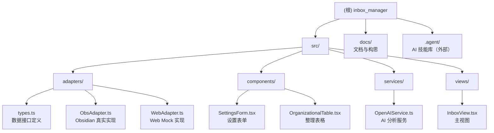

# Inbox Manager - Obsidian AI Inbox Organizer

> 最后更新：2026-01-17 19:27:29

## 变更记录 (Changelog)

### 2026-01-17
- 初始化项目 AI 上下文文档
- 完成全仓扫描与架构分析
- 生成模块结构图与技术栈文档

---

## 项目愿景

Inbox Manager 是一个 **AI 驱动的 Obsidian 插件**，旨在解决知识管理中"Inbox 文件夹堆积、分类难"的痛点问题。通过 OpenAI API（或兼容服务）自动分析 Inbox 中的笔记内容，提供智能分类建议，并支持一键归档到目标文件夹，同时自动添加标签和属性。

**核心理念**：利用 AI 减少"第二大脑"知识管理的摩擦力，让信息流动更自动化。

---

## 架构总览

### 技术选型

| 层级 | 技术 | 用途 |
|------|------|------|
| **前端框架** | React 18 + TypeScript | UI 组件与状态管理 |
| **构建工具** | Vite 5 | 快速开发与热更新 |
| **宿主环境** | Obsidian Plugin API | 文件操作与视图集成 |
| **AI 服务** | OpenAI SDK | 内容分析与分类建议 |
| **设计模式** | Adapter Pattern | 双端适配（Web + Obsidian） |

### 架构亮点：Web 优先 + 适配器模式

项目采用 **"Web-First"** 开发策略，将业务逻辑与 Obsidian API 完全解耦：

- **Web 端（90% 开发时间）**：浏览器环境快速迭代 UI/UX，使用 Mock 数据验证逻辑
- **Obsidian 端（10% 集成时间）**：通过适配器接入真实 Vault 数据

这种架构实现了：
- 开发效率提升（HMR、React DevTools、快速重载）
- 代码可测试性（纯 UI 组件无 Obsidian 依赖）
- 平台可扩展性（易于迁移到其他平台）

---

## 模块结构图



---

## 模块索引

| 模块路径 | 职责 | 语言 | 入口文件 | 测试 | 配置 |
|---------|------|------|---------|------|------|
| `src/adapters/` | 数据适配层：定义接口与双端实现 | TypeScript | `types.ts` | ❌ | - |
| `src/components/` | React UI 组件（纯视图层） | TSX | `SettingsForm.tsx` | ❌ | - |
| `src/services/` | 业务服务：AI 分析、外部 API | TypeScript | `OpenAIService.ts` | ❌ | - |
| `src/views/` | 视图层：React 页面组合 | TSX | `InboxView.tsx` | ❌ | - |
| `docs/` | 项目文档与构思 | Markdown | `Obsidian 插件构思.md` | - | - |

---

## 运行与开发

### 开发模式

```bash
# Web 模式（推荐用于日常开发）
npm run dev
# 访问 http://localhost:4000
# 优势：HMR、React DevTools、快速迭代

# Obsidian 插件模式（集成测试）
npm run dev:plugin
# 在 Obsidian 设置中启用插件
# 优势：验证真实文件操作、主题适配

# 生产构建
npm run build
```

### 项目启动点

| 环境 | 入口文件 | 适配器 |
|------|---------|--------|
| **Web** | `src/web-entry.tsx` | `WebAdapter` (Mock 数据) |
| **Obsidian** | `src/main.ts` | `ObsAdapter` (Vault API) |

### 配置说明

插件配置存储在 `data.json`（由 Obsidian API 管理）：

```typescript
interface PluginSettings {
  apiKey: string;        // OpenAI API Key
  baseURL: string;       // 可选：自定义 API 端点
  inboxPath: string;     // Inbox 文件夹路径（默认 "Inbox"）
}
```

---

## 测试策略

**当前状态**：无自动化测试

**建议补充**：
- [ ] 单元测试：`OpenAIService` 的 prompt 构建与响应解析
- [ ] 组件测试：React 组件的交互逻辑（使用 Vitest + Testing Library）
- [ ] 集成测试：适配器接口的行为验证
- [ ] E2E 测试：Obsidian 插件的完整工作流

---

## 编码规范

### TypeScript 配置

- **目标**：ES6
- **模块**：ESNext
- **严格模式**：`noImplicitAny: true`
- **JSX**：`react-jsx` (新 JSX 转换)
- **类型导入**：支持 `vite/client` 类型

### 代码风格

- **组件模式**：函数组件 + Hooks
- **状态管理**：React `useState`、`useEffect`、`useCallback`
- **依赖注入**：通过 Props 传递 `adapter` 实现数据层解耦
- **错误处理**：Service 层使用 `try-catch`，UI 层显示友好提示

### 命名约定

- **接口**：PascalCase（如 `DataProvider`）
- **类型**：PascalCase（如 `FileMetadata`）
- **组件**：PascalCase（如 `InboxView`）
- **函数/变量**：camelCase（如 `loadInboxFiles`）

---

## AI 使用指引

### 核心工作流

1. **文件加载**：通过 `adapter.loadInboxFiles()` 读取 Inbox 文件夹
2. **AI 分析**：调用 `OpenAIService.generateSuggestions()` 获取分类建议
3. **用户确认**：在 `OrganizationalTable` 中展示建议，用户可 Accept/Ignore
4. **执行归档**：调用 `adapter.moveFile()` 和 `adapter.updateFrontmatter()`

### AI 能力边界

**当前实现**：
- ✅ Mock 建议（关键词分析）
- ⏳ 真实 LLM 调用（已预留接口，待实现）

**待开发功能**：
- [ ] 实现 OpenAI Structured Output 调用
- [ ] 支持自定义分类规则（PARA 方法论）
- [ ] 批量处理优化（减少 API 调用次数）
- [ ] 错误重试机制（确保输出符合结构化要求）

### Prompt 设计建议

参考 `OpenAIService.ts` 中的 TODO 注释：

```typescript
// 建议使用 OpenAI Structured Output
// 参考：https://platform.openai.com/docs/guides/structured-outputs
// 字段：targetFolder, tags[], area?, reason
```

---

## 技术债务与改进建议

### 已知问题

1. **无真实 AI 调用**：当前使用 Mock 数据，需实现 OpenAI API 集成
2. **无错误处理**：API 失败时缺少用户友好的提示
3. **无测试覆盖**：核心逻辑缺少自动化测试

### 性能优化建议

- [ ] Inbox 文件数量大时，考虑分批处理或虚拟滚动
- [ ] API 调用使用流式响应（Streaming）提升体验
- [ ] 缓存 AI 分析结果，避免重复调用

### 架构演进方向

- [ ] 支持更多 LLM 提供商（Claude、本地模型）
- [ ] 可视化配置编辑器（拖拽式规则配置）
- [ ] 跨平台扩展（移动端、Web 独立应用）

---

## 相关资源

### 内部文档

- [插件构思文档](docs/Obsidian%20插件构思：AI%20第二大脑%20Inbox%20自动整理.md)
- [开发架构文档](docs/obsidian开发方式.md)

### 外部依赖

- [Obsidian Plugin API](https://github.com/obsidianmd/obsidian-api)
- [OpenAI SDK](https://github.com/openai/openai-node)
- [React 18 文档](https://react.dev/)
- [Vite 文档](https://vitejs.dev/)

---

## 常见问题 (FAQ)

**Q: 为什么使用 Web 优先开发？**
A: Obsidian 插件开发调试效率低（重载慢、无 DevTools）。通过适配器模式，可以在浏览器中快速迭代 UI，最后再集成到 Obsidian。

**Q: 如何切换到真实 AI 服务？**
A: 在 `OpenAIService.ts` 中实现真实的 LLM 调用，移除 `mockSuggestions()` 方法，使用 Structured Output 确保 JSON 格式正确。

**Q: 支持自定义分类规则吗？**
A: 当前版本不支持，但可通过修改 Prompt 扩展。未来版本将支持可视化规则配置器。

---

## 覆盖率报告

**本次扫描统计**：
- 估算总文件数：~2,000+（包含 node_modules、.agent 等外部依赖）
- 已扫描核心文件：15 个（src/ 目录全部文件）
- 核心代码覆盖率：100%（src/ 目录）
- 文档覆盖率：100%（关键文档已读取）

**忽略/跳过的内容**：
- `node_modules/`：第三方依赖库
- `.agent/`：外部 AI 技能库（非本项目核心）
- `.git/`：版本控制文件
- `.claude/`：AI 辅助工具配置
- `obsidian-release/`：发布产物（已构建文件）

**未扫描模块**：
- 无（核心模块已全部扫描）

**建议下一步深挖**：
- [ ] 实现真实的 OpenAI API 调用（`src/services/OpenAIService.ts`）
- [ ] 添加错误处理与用户提示（Toast 通知）
- [ ] 编写单元测试与集成测试
- [ ] 优化批量处理性能（大量文件场景）
- [ ] 支持自定义 Prompt 模板

---

*文档生成时间：2026-01-17 19:27:29*
*扫描工具：Claude Code Architect (Adaptive Mode)*
