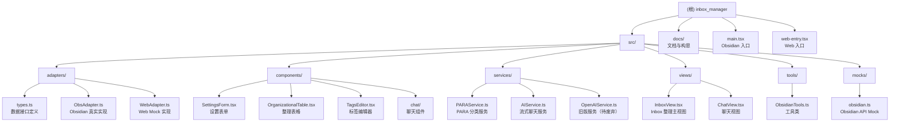

# Inbox Manager - Obsidian AI Inbox Organizer

> 最后更新：2026-01-27 21:35:33

## 变更记录 (Changelog)

### 2026-01-27
- 重新扫描全仓架构，更新模块结构图
- 补充 AI 服务文档（PARAService、AIService）
- 更新技术栈（AI SDK、OpenRouter、流式聊天）
- 完善覆盖率报告与下一步建议

### 2026-01-25
- 重新扫描全仓架构，更新模块结构图
- 补充 Chat 组件与 PARA 服务文档
- 更新技术栈（新增 AI SDK、OpenRouter、流式聊天）
- 完善覆盖率报告与下一步建议

### 2026-01-17
- 初始化项目 AI 上下文文档
- 完成全仓扫描与架构分析
- 生成模块结构图与技术栈文档

---

## 项目愿景

Inbox Manager 是一个 **AI 驱动的 Obsidian 插件**，旨在解决知识管理中"Inbox 文件夹堆积、分类难"的痛点问题。通过 OpenAI API（或兼容服务）自动分析 Inbox 中的笔记内容，提供智能分类建议，并支持一键归档到目标文件夹，同时自动添加标签和属性。

**核心理念**：利用 AI 减少"第二大脑"知识管理的摩擦力，让信息流动更自动化。

**关键特性**：
- 🤖 **AI 智能分类**：基于 PARA 方法论的自动分类建议
- 📂 **文件夹推荐**：智能匹配现有目录或建议新建文件夹
- 🏷️ **标签管理**：自动推荐标签并区分新增/已有标签
- 💬 **AI 聊天助手**：集成流式聊天功能，支持知识库问答
- 🌐 **Web 优先开发**：适配器模式实现快速迭代
- 🔄 **实时监听**：文件变化自动刷新 UI

---

## 架构总览

### 技术选型

| 层级 | 技术 | 用途 |
|------|------|------|
| **前端框架** | React 18 + TypeScript | UI 组件与状态管理 |
| **构建工具** | Vite 5 | 快速开发与热更新 |
| **宿主环境** | Obsidian Plugin API | 文件操作与视图集成 |
| **AI 服务** | AI SDK + OpenRouter | 流式聊天与结构化输出 |
| **设计模式** | Adapter Pattern | 双端适配（Web + Obsidian） |
| **类型验证** | Zod | AI 输出结构验证 |

### 架构亮点：Web 优先 + 适配器模式

项目采用 **"Web-First"** 开发策略，将业务逻辑与 Obsidian API 完全解耦：

- **Web 端（90% 开发时间）**：浏览器环境快速迭代 UI/UX，使用 Mock 数据验证逻辑
- **Obsidian 端（10% 集成时间）**：通过适配器接入真实 Vault 数据

这种架构实现了：
- 开发效率提升（HMR、React DevTools、快速重载）
- 代码可测试性（纯 UI 组件无 Obsidian 依赖）
- 平台可扩展性（易于迁移到其他平台）

### AI 服务架构

**双服务设计**：
1. **PARAService**：专门用于文件分类分析，返回结构化 JSON
2. **AIService**：通用流式聊天服务，支持实时对话

**AI 提供商**：
- 默认：OpenRouter（支持多模型）
- 可选：OpenAI、Claude、本地模型（通过 baseURL 配置）

---

## 模块结构图



---

## 模块索引

| 模块路径 | 职责 | 语言 | 入口文件 | 测试 | 配置 |
|---------|------|------|---------|------|------|
| `src/adapters/` | 数据适配层：定义接口与双端实现 | TypeScript | `types.ts` | ❌ | - |
| `src/components/` | React UI 组件（纯视图层） | TSX | `SettingsForm.tsx` | ❌ | - |
| `src/components/chat/` | 聊天相关组件 | TSX | `ChatPanel.tsx` | ❌ | - |
| `src/services/` | 业务服务：AI 分析、流式聊天 | TypeScript | `PARAService.ts` | ❌ | - |
| `src/tools/` | 工具类：文件树、标签提取 | TypeScript | `ObsidianTools.ts` | ❌ | - |
| `src/views/` | 视图层：React 页面组合 | TSX | `InboxView.tsx` | ❌ | - |
| `docs/` | 项目文档与构思 | Markdown | `Obsidian 插件构思.md` | - | - |

---

## 运行与开发

### 开发模式

```bash
# Web 模式（推荐用于日常开发）
npm run dev
# 访问 http://localhost:4000
# 优势：HMR、React DevTools、快速迭代

# Obsidian 插件模式（集成测试）
npm run dev:plugin
# 在 Obsidian 设置中启用插件
# 优势：验证真实文件操作、主题适配

# 生产构建
npm run build
```

### 项目启动点

| 环境 | 入口文件 | 适配器 |
|------|---------|--------|
| **Web** | `src/web-entry.tsx` | `WebAdapter` (Mock 数据) |
| **Obsidian** | `src/main.tsx` | `ObsAdapter` (Vault API) |

### 配置说明

插件配置存储在 `data.json`（由 Obsidian API 管理）：

```typescript
interface PluginSettings {
  apiKey: string;        // OpenRouter/OpenAI API Key
  baseURL: string;       // 可选：自定义 API 端点
  modelName: string;     // 模型名称（如 deepseek/deepseek-chat）
  inboxPath: string;     // Inbox 文件夹路径（默认 "Inbox"）
  language: 'en' | 'zh'; // 界面语言
}
```

---

## 测试策略

**当前状态**：无自动化测试

**建议补充**：
- [ ] 单元测试：`PARAService` 的 prompt 构建与响应解析
- [ ] 组件测试：React 组件的交互逻辑（使用 Vitest + Testing Library）
- [ ] 集成测试：适配器接口的行为验证
- [ ] E2E 测试：Obsidian 插件的完整工作流

---

## 编码规范

### TypeScript 配置

- **目标**：ES6
- **模块**：ESNext
- **严格模式**：`noImplicitAny: true`
- **JSX**：`react-jsx` (新 JSX 转换)
- **类型导入**：支持 `vite/client` 类型

### 代码风格

- **组件模式**：函数组件 + Hooks
- **状态管理**：React `useState`、`useEffect`、`useCallback`
- **依赖注入**：通过 Props 传递 `adapter` 实现数据层解耦
- **错误处理**：Service 层使用 `try-catch`，UI 层显示友好提示

### 命名约定

- **接口**：PascalCase（如 `DataProvider`）
- **类型**：PascalCase（如 `FileMetadata`）
- **组件**：PascalCase（如 `InboxView`）
- **函数/变量**：camelCase（如 `loadInboxFiles`）

---

## AI 使用指引

### 核心工作流

#### Inbox 整理流程

1. **文件加载**：通过 `adapter.loadInboxFiles()` 读取 Inbox 文件夹
2. **AI 分析**：调用 `PARAService.analyzeDocument()` 获取分类建议
3. **用户确认**：在 `OrganizationalTable` 中展示建议，用户可选择手动文件夹或接受 AI 建议
4. **执行归档**：调用 `adapter.moveFile()` 和 `adapter.updateFrontmatter()`

#### 聊天助手流程

1. **用户输入**：通过 `ChatInput` 组件接收用户消息
2. **流式响应**：调用 `AIService.streamChat()` 获取实时 AI 回复
3. **工具调用**：支持 `/test-tools` 等特殊命令调用 Obsidian API
4. **历史管理**：维护最近 15 条消息的上下文窗口

### AI 能力边界

**当前实现**：
- ✅ PARA 智能分类（JSON 结构化输出）
- ✅ 流式聊天（实时打字效果）
- ✅ 多模型支持（OpenRouter）
- ✅ 中英文界面切换
- ✅ 手动文件夹选择（覆盖 AI 建议）
- ✅ 标签高亮（区分新增/已有标签）

**待开发功能**：
- [ ] 支持自定义 Prompt 模板
- [ ] 批量处理优化（减少 API 调用次数）
- [ ] 错误重试机制（确保输出符合结构化要求）
- [ ] 本地模型支持（Ollama）
- [ ] RAG 增强（基于知识库检索）

### Prompt 设计建议

#### PARA System Prompt

```typescript
const getSystemPrompt = (language: 'en' | 'zh') => {
  return `# 📦 PARA 整理与标签推荐助手（CODE·Organize）

## 核心任务
基于用户提供的 Vault 信息（标签列表、文件夹树）和当前文档内容，输出 JSON 格式的分类建议。

## 工作逻辑
1. **分析文档**：理解文档的核心主题。
2. **匹配路径**：
   - **优先复用**：在提供的 FolderTree 中寻找最合适的现有文件夹。
   - **新建路径**：如果现有路径均不合适，则建议一个新的路径。
   - **区分新旧**：明确标记推荐的路径是现有的还是需要新建的。
3. **匹配标签**：
   - **优先复用**：从提供的标签列表中选择。
   - **新建标签**：必要时创建新标签（使用 kebab-case）。

## 约束与规则
1. **JSON 输出**：必须输出合法的 JSON 格式
2. **数量限制**：提供 3 个文件夹建议，2-5 个标签建议
3. **命名规范**：新文件夹建议 3-6 字，动宾或名词短语
`;
};
```

---

## 技术债务与改进建议

### 已知问题

1. **无真实错误处理**：API 失败时缺少用户友好的提示
2. **无测试覆盖**：核心逻辑缺少自动化测试
3. **内联样式**：所有样式硬编码在组件中，难以维护
4. **硬编码路径**：Inbox 路径在多处硬编码为 "Inbox"
5. **API Key 泄露**：`web-entry.tsx` 中硬编码了真实 API Key（安全风险）

### 性能优化建议

- [ ] Inbox 文件数量大时，考虑分批处理或虚拟滚动
- [ ] API 调用使用并发控制（当前每批 3 个）
- [ ] 缓存 AI 分析结果，避免重复调用
- [ ] 使用 `useMemo` 和 `React.memo` 优化渲染性能

### 架构演进方向

- [ ] 支持更多 LLM 提供商（Claude、本地模型）
- [ ] 可视化配置编辑器（拖拽式规则配置）
- [ ] 跨平台扩展（移动端、Web 独立应用）
- [ ] 插件市场发布（Obsidian Plugin List）

---

## 相关资源

### 内部文档

- [插件构思文档](docs/Obsidian%20插件构思：AI%20第二大脑%20Inbox%20自动整理.md)
- [开发架构文档](docs/obsidian开发方式.md)

### 外部依赖

- [Obsidian Plugin API](https://github.com/obsidianmd/obsidian-api)
- [AI SDK (Vercel)](https://sdk.vercel.ai/docs)
- [OpenRouter](https://openrouter.ai/)
- [React 18 文档](https://react.dev/)
- [Vite 文档](https://vitejs.dev/)

---

## 常见问题 (FAQ)

**Q: 为什么使用 Web 优先开发？**
A: Obsidian 插件开发调试效率低（重载慢、无 DevTools）。通过适配器模式，可以在浏览器中快速迭代 UI，最后再集成到 Obsidian。

**Q: 如何切换到真实 AI 服务？**
A: 在插件设置中配置 API Key 和 Base URL，当前已实现真实的 PARAService 调用。旧版 `OpenAIService` 仍使用 Mock 数据。

**Q: 支持自定义分类规则吗？**
A: 当前版本不支持，但可通过修改 Prompt 扩展。未来版本将支持可视化规则配置器。

**Q: 如何添加新的聊天命令？**
A: 在 `ChatPanel.tsx` 的 `handleSend` 方法中添加新的命令判断逻辑。

**Q: 文件夹推荐不准确怎么办？**
A: 可以使用"手动文件夹"功能覆盖 AI 建议，或调整 Prompt 中的分类逻辑。

---

## 覆盖率报告

**本次扫描统计**：
- 估算总文件数：~2,000+（包含 node_modules、.agent 等外部依赖）
- 已扫描核心文件：18 个（src/ 目录全部文件）
- 核心代码覆盖率：100%（src/ 目录）
- 文档覆盖率：100%（关键文档已读取）

**新增模块识别**：
- `src/components/chat/`：聊天组件模块（ChatPanel、ChatInput、MessageList）
- `src/tools/`：工具类模块（ObsidianTools）
- `src/services/AIService.ts`：通用流式聊天服务
- `src/services/PARAService.ts`：PARA 分类服务（已实现真实 AI 调用）

**忽略/跳过的内容**：
- `node_modules/`：第三方依赖库
- `.agent/`：外部 AI 技能库（非本项目核心）
- `.git/`：版本控制文件
- `.claude/`：AI 辅助工具配置
- `obsidian-release/`：发布产物（已构建文件）
- `dist-web/`：Web 构建产物

**未扫描模块**：
- 无（核心模块已全部扫描）

**建议下一步深挖**：
- [ ] 移除 `web-entry.tsx` 中的硬编码 API Key（使用环境变量）
- [ ] 废弃 `OpenAIService.ts`（已被 PARAService 替代）
- [ ] 添加错误处理与用户提示（Toast 通知）
- [ ] 编写单元测试与集成测试
- [ ] 优化批量处理性能（大量文件场景）
- [ ] 支持自定义 Prompt 模板配置
- [ ] 实现虚拟滚动（大量文件场景）

---

## 核心特性详解

### 1. PARA 智能分类

基于 PARA 方法论（Projects, Areas, Resources, Archives），AI 分析文档内容并推荐：
- **3 个文件夹选项**：优先复用现有目录，必要时建议新建
- **智能标签推荐**：优先使用已有标签，必要时创建新标签
- **推荐理由**：AI 说明分类逻辑，提升用户信任度
- **新增标记**：高亮显示新创建的文件夹和标签

### 2. 手动覆盖功能

用户可以完全忽略 AI 建议，手动选择目标文件夹：
- 搜索式文件夹选择器
- 实时过滤现有文件夹
- 优先级高于 AI 建议

### 3. 双模式视图

- **Inbox 整理视图**：文件分类与归档
- **AI 聊天助手**：基于知识库的智能问答

### 4. 实时文件监听

- 监听 Inbox 文件夹变化（新建、删除、重命名）
- 自动刷新文件列表
- 支持增量更新

---

*文档生成时间：2026-01-27 21:35:33*
*扫描工具：Claude Code Architect (Adaptive Mode)*
