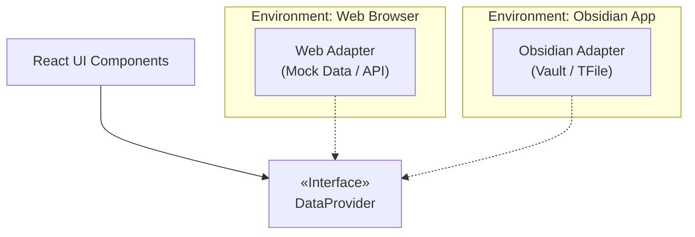

# Obsidian 插件开发：Web 优先架构 (React + Adapter 模式)

- **Status**: #Distilled 
- **Tags**: #obsidian/dev #architecture #react #design-pattern #workflow
- **Date**: 2026-01-17

## 一、 核心理念：Web 优先 (Web-First)

为了避开 Electron 环境调试的低效（重载慢、工具链重、难以使用 React DevTools），采用 **"Web First"** 策略。其核心是将业务逻辑与 Obsidian API 解耦，实现单体仓库，双端运行。

- **Web 端 (90% 时间)**：负责 UI/UX 快速迭代、算法验证、复杂业务逻辑编写。
- **Obsidian 端 (10% 时间)**：仅作为最终运行容器，通过适配器接入真实数据（Vault/TFile）。

## 二、 架构设计：适配器模式 (Adapter Pattern)

利用适配器模式隔离数据层。UI 组件不直接依赖 Obsidian API，而是依赖一个通用的数据接口（Interface）。



## 三、 项目结构与代码实现

### 3.1 目录结构
```text
src/
├── components/       # 纯净 UI 组件 (无 Obsidian 依赖)
├── adapters/         
│   ├── types.ts      # 定义 DataProvider 接口
│   ├── WebAdapter.ts # 浏览器用的 Mock 实现
│   └── ObsAdapter.ts # 插件用的真实实现
├── web-entry.tsx     # Web 入口 (ReactDOM.render -> #root)
└── main.ts           # Obsidian 入口 (ItemView -> this.containerEl)
```

### 3.2 关键代码模式

**A. 定义接口 (types.ts)**
```typescript
export interface DataProvider {
  loadData(): Promise<any>; // 组件只管调用这个，不问来源
}
```

**B. 浏览器入口 (web-entry.tsx)**
```typescript
import { WebAdapter } from './adapters/WebAdapter';
// 注入 Mock 适配器
root.render(<Dashboard adapter={new WebAdapter()} />);
```

**C. Obsidian 入口 (main.ts)**
```typescript
import { ItemView } from 'obsidian';
import { ObsAdapter } from './adapters/ObsAdapter';

export class BiView extends ItemView {
  async onOpen() {
    const root = createRoot(this.containerEl.children[1]);
    // 注入真实 Obsidian 适配器
    root.render(<Dashboard adapter={new ObsAdapter(this.app)} />);
  }
}
```

## 四、 开发工作流 (Workflow)

在 `package.json` 中配置双通道脚本，支持快速反馈循环：

- **极速开发模式 (`npm run dev`)**:
  - 启动 Vite Server (Web)。
  - **环境**：Chrome 浏览器。
  - **优势**：HMR 热更新、React DevTools、Mock 极端数据。
- **集成测试模式 (`npm run dev:plugin`)**:
  - 启动 Vite Build (Watch Mode)。
  - **环境**：Obsidian 桌面端。
  - **配合插件**：Hot-Reload。
  - **优势**：验证真实文件读取、处理 Obsidian 主题样式适配。

## 五、 CSS 适配技巧

为了让 Web 开发效果接近 Obsidian，在 Web 的 `index.html` 中注入 Obsidian 的 CSS 变量：

```css
/* Web 模拟 Obsidian 基础变量 */
:root {
  --background-primary: #ffffff;
  --text-normal: #2e3338;
  --interactive-accent: #7a51d1;
  /* 开发时记得测试暗黑模式变量 */
}
```

## 六、 总结与思考

这种架构实现了**业务逻辑与宿主环境的彻底解耦**。它不仅提升了开发效率，还为未来可能的平台迁移（如移动端或 Web 版工具集成）打下了坚实基础，符合“项目大脑”中对架构文档长期生命力的要求。