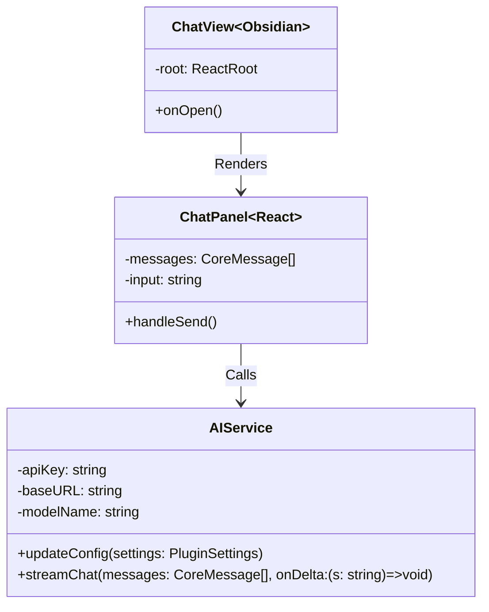

# 设计文档: Second Brain Manager Phase 2 (AI Infrastructure & Connectivity)

- **日期**: 2026-01-18
- **状态**: 待定 (Draft)
- **作者**: Antigravity

## 1. 概述 (Overview)

Phase 2 的核心目标是完成从 "Inbox Manager" 到 "Second Brain Manager" 的品牌升级，并构建稳固的 AI 基础设施。我们将引入 **Vercel AI SDK** 替代原生的 `openai` 库，以获得更好的流式传输支持和多模型兼容性。同时，增加一个侧边栏对话窗口 (Chat Interface) 用于验证 API 连接性。

## 2. 关键决策 (Key Decisions)

- **SDK 选型**: 采用 **@ai-sdk/openai + ai Core**。
  - *理由*: Obsidian 插件是纯客户端环境，无法运行 Next.js 的 API Route。直接使用 Provider + Core API (`streamText`) 可以手动管理流式响应，既保留了 Vercel AI SDK 的统一接口优势，又能完美适配 Obsidian 环境。
- **对话窗口形态**: **Ribbon Icon + Right Sidebar Leaf**。
  - *理由*: 既然定位为 "Second Brain Manager"，在这个侧边栏提供常驻的 AI 助手入口非常符合直觉。
- **模型配置**: **纯文本输入框**。
  - *理由*: 为了最大化兼容 OpenRouter, OneAPI 等中转服务，允许用户输入任意模型 ID (如 `anthropic/claude-3-5-sonnet`)。

## 3. 详细设计 (Detailed Design)

### 3.1 核心类图



### 3.2 数据流 (Streaming Data Flow)

1. **用户输入**: 用户在 `ChatPanel` 输入消息，按 Enter。
2. **状态更新**: `ChatPanel` 立即将用户消息加入 `messages` 列表，并添加一个空的 Assistant 消息占位符。
3. **服务调用**: `ChatPanel` 调用 `AIService.streamChat(history, callback)`。
4. **流式接收**:
   - `AIService` 使用 `streamText` 发起请求。
   - `onDelta` 回调在每收到一个 chunk 时触发。
   - `ChatPanel` 更新最后一条 Assistant 消息的内容，实现打字机效果。
5. **结束/错误**: 请求完成或失败时，更新 UI 状态（Loading -> Idle/Error）。

### 3.3 目录结构调整

```text
src/
├── services/
│   ├── AIService.ts       # [NEW] Vercel AI SDK 实现
│   └── OpenAIService.ts   # [DEPRECATED] 逐步迁移
├── components/
│   └── chat/              # [NEW] 对话相关组件
│       ├── ChatPanel.tsx
│       ├── MessageList.tsx
│       └── ChatInput.tsx
├── views/
│   ├── ChatView.ts        # [NEW] Obsidian View 包装器
│   └── InboxView.tsx      # [EXISTING]
└── main.ts                # 注册新 View 和 Icon
```

## 4. 验证计划

1. **Web 环境验证**:
   - 修改 `web-entry.tsx` 引入 `ChatPanel`。
   - 启动 `npm run dev`。
   - 输入测试 Key (如有) 或 Mock 数据，验证 UI 的消息气泡渲染和流式效果。

2. **Obsidian 环境验证**:
   - 构建插件。
   - 打开设置页，配置 API Key, Base URL 和模型名。
   - 打开侧边栏 "Brain" 图标。
   - 发送 "Hi"，确认能收到流式回复。
